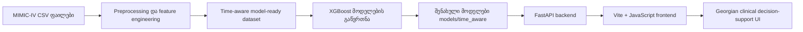

# ტექნიკური დოკუმენტაცია

პროექტი: გულ-სისხლძარღვთა დაავადებების ადრეული დიაგნოსტიკის დამხმარე სისტემა მანქანური სწავლების გამოყენებით

ავტორი: ნინო ჯინჭარაძე

GitHub repository:

```text
https://github.com/Ninucaa/bachelor-thesis-cardiovascular-ml
```

დოკუმენტაციის დანიშნულება: ეს ფაილი წარმოადგენს საბოლოო ჩაბარებისთვის ერთიან ტექნიკურ report-ს. მასში თავმოყრილია GitHub ბმული, სისტემის არქიტექტურა, API დოკუმენტაცია, ინსტალაციის ინსტრუქცია, მომხმარებლის flow/use cases, შეზღუდვები და იმ კომპონენტების განმარტება, რომლებიც შუალედური გეგმის შემდეგ შეიცვალა.

## 1. პროექტის მიზანი

პროექტის მიზანია შეიქმნას decision-support ტიპის ვებ სისტემა, რომელიც პაციენტის კლინიკური მონაცემების საფუძველზე აფასებს გულ-სისხლძარღვთა დაავადებების სავარაუდო დიაგნოსტიკურ მიმართულებას. სისტემა არ ცვლის ექიმის საბოლოო გადაწყვეტილებას. მისი დანიშნულებაა ექიმს ან მომხმარებელს აჩვენოს, რომელ ICD-კოდირებულ გულ-სისხლძარღვთა დიაგნოზის ჯგუფთან ხედავს მოდელი ყველაზე ძლიერ სიგნალს და რომელი ფაქტორები განსაზღვრავს ამ შედეგს.

დიაგნოსტიკური ჯგუფების ნაწილი აგებულია multi-label მიდგომით: თითოეული კლინიკური ჯგუფი დამოუკიდებლად ფასდება, რადგან MIMIC-IV/ICD მონაცემებში ერთ admission-ს ხშირად რამდენიმე თანმხლები გულ-სისხლძარღვთა დიაგნოზი აქვს. Frontend-ში ერთი ჯგუფი გამოიყოფა როგორც მთავარი სავარაუდო მიმართულება, ხოლო მის ქვემოთ ნაჩვენებია მაქსიმუმ top 2 დამატებით გადასამოწმებელი კლინიკური სიგნალი. დანარჩენი სიგნალები ხელმისაწვდომია “ყველა სიგნალის ნახვა” რეჟიმში. ეს სიგნალები არ განიმარტება როგორც რამდენიმე საბოლოო დიაგნოზი.

სისტემა აფასებს შემდეგ დიაგნოსტიკურ ჯგუფებს:

- მიოკარდიუმის ინფარქტი
- გულის უკმარისობა
- სუბარაქნოიდული სისხლჩაქცევა
- ინტრაცერებრული სისხლჩაქცევა
- იშემიური ინსულტი / ცერებრული ინფარქტი
- სხვა ცერებროვასკულური დაავადება
- AV ბლოკადა / გამტარობის დარღვევა
- გულის გაჩერება
- პაროქსიზმული ტაქიკარდია
- წინაგულთა ფიბრილაცია / flutter
- სხვა გულის არითმია
- პირველადი ჰიპერტენზია
- ჰიპერტენზიული გულის დაავადება
- ჰიპერტენზიული თირკმლის დაავადება
- ჰიპერტენზიული გულის და თირკმლის დაავადება
- ჰიპერტენზიული კრიზი
- სტენოკარდია
- მწვავე იშემიური გულის დაავადება
- ქრონიკული იშემიური გულის დაავადება

## 2. სისტემის არქიტექტურა

მაღალი დონის არქიტექტურა:



ძირითადი კომპონენტები:

- `src/build_time_aware_dataset.py` - MIMIC-IV ფაილებიდან time-aware dataset-ის აგება.
- `src/train_time_aware_model.py` - ძირითადი და საწყისი ICD subtype XGBoost მოდელების გაწვრთნა.
- `src/train_clinical_group_models.py` - აქტიური კლინიკური ჯგუფების XGBoost მოდელების გაწვრთნა.
- `src/build_clinical_group_thresholds.py` - clinical group threshold-ების შერჩევა validation split-ზე.
- `src/api/app.py` - FastAPI endpoint-ები.
- `src/api/model_service.py` - მოდელის ჩატვირთვა, feature validation, prediction და ინტერპრეტაცია.
- `frontend/src/main.js` - ქართულენოვანი UI და API-სთან კომუნიკაცია.
- `frontend/src/styles.css` - frontend-ის ვიზუალური სტილი.
- `scripts/run_backend.sh` - backend-ის სტაბილური local run script.
- `scripts/run_frontend.sh` - frontend-ის local run script.
- `scripts/test_backend.sh` - backend API smoke tests.
- `Dockerfile`, `docker-compose.yml` - backend-ის containerized გაშვების კონფიგურაცია.

## 3. მონაცემები

მონაცემთა წყაროა MIMIC-IV/PhysioNet-ის დეიდენტიფიცირებული კლინიკური მონაცემები. MIMIC-IV მოიცავს Beth Israel Deaconess Medical Center-ის გადაუდებელი განყოფილებისა და ინტენსიური თერაპიის მონაცემებს და ორგანიზებულია ძირითადად hosp და icu მოდულებად. მონაცემებზე წვდომისთვის საჭიროა PhysioNet-ის credentialed access პროცესი და შესაბამისი კვლევითი/ეთიკური სწავლების გავლა; პროექტში მონაცემებთან მუშაობა შესრულდა ასეთი წვდომის მიღებისა და CITI Data or Specimens Only Research სერტიფიკატის შემდეგ.

Raw CSV ფაილები GitHub-ზე არ არის ატვირთული, რადგან ისინი დიდი ზომისაა და ექვემდებარება მონაცემთა გამოყენების შეზღუდვებს. MIMIC-IV-ში პაციენტის იდენტიფიკატორები ამოღებულია ან შეცვლილია, ხოლო თარიღები კონფიდენციალურობის დაცვის მიზნით გადანაცვლებულია. ერთი პაციენტის ჩანაწერებში მოვლენების ქრონოლოგია მაინც შენარჩუნებულია.

საწყისი სამუშაო ფაილების (`cardio_training_features.csv` და `sample_test_patients.csv`) შექმნისას გამოყენებული იყო MIMIC-IV-ის რამდენიმე მოდული და დაკავშირებული CSV ფაილები, მათ შორის `MIMIC-IV-hosp`, `MIMIC-IV-ED`, `MIMIC-IV-ICU`, `MIMIC-IV-Note` და `MIMIC-IV-ECG`. ეს წყაროები გამოიყენებოდა პაციენტის დემოგრაფიული, ჰოსპიტალიზაციის, დიაგნოზების, ლაბორატორიული, გადაუდებელი განყოფილების, ICU/vital signs, კლინიკური ჩანაწერებისა და ECG კონტექსტის მოსამზადებლად. საბოლოო time-aware მოდელისთვის ამ წყაროებიდან შენარჩუნდა ის admission-level, ლაბორატორიული, vital signs, ED/triage, OMR და ICD-კოდებზე დაფუძნებული მახასიათებლები, რომლებიც მოდელის feature schema-ში შევიდა.

საბოლოო time-aware pipeline-ში უშუალოდ გამოყენებული ძირითადი მონაცემთა ჯგუფები:

- admissions და patients - admission და დემოგრაფიული ინფორმაცია.
- diagnoses_icd - ICD კოდებზე დაფუძნებული სამიზნე ცვლადები და ისტორიული დაავადებები.
- labevents - ლაბორატორიული მაჩვენებლები.
- chartevents - vital signs/ICU ტიპის გაზომვები.
- edstays და triage - გადაუდებელი განყოფილების triage მონაცემები.
- omr - BMI, წონა, სიმაღლე და outpatient blood pressure.

Final time-aware dataset-ის summary ინახება:

```text
reports/time_aware_dataset_report.md
reports/time_aware_feature_summary.json
```

საბოლოო time-aware dataset-ის ზომაა 546,028 admission-level ჩანაწერი და 289 სვეტი. მათგან 260 სვეტი გამოიყენება როგორც model input feature, ხოლო დანარჩენი სვეტები მოიცავს target-ებს, split/meta ინფორმაციას და დამხმარე ველებს. დამატებითი ICD target-ების სინქრონიზაციის შემდეგ დადებითი `target_cvd` კლასი ფიქსირდება 339,173 ჩანაწერში (62.12%). მონაცემები გაყოფილია patient-level split-ით: train 70.13%, validation 19.77%, test 10.10%. train/validation/test ნაწილებს შორის `subject_id` overlap არის 0.

PostgreSQL გამოყენებული იყო მონაცემთა საწყისი მომზადებისა და feature table-ის ექსპორტის ეტაპზე (`cardio_training_features.csv`). მიმდინარე web prototype runtime-ში PostgreSQL-ს არ უკავშირდება; FastAPI backend იყენებს უკვე მომზადებულ model-ready CSV-ს, saved model artifacts-ს და `models/time_aware/feature_columns.json` schema-ს.

## 4. Preprocessing და feature engineering

Preprocessing-ის მთავარი პრინციპია time-aware აგება: მოდელმა არ უნდა გამოიყენოს ისეთი ინფორმაცია, რომელიც პაციენტის ადრეული შეფასების მომენტში ჯერ ცნობილი არ იქნებოდა.

შესრულებული ნაბიჯები:

- მონაცემების გაერთიანება admission დონეზე.
- ლაბორატორიული და vital signs მონაცემების აგრეგაცია პირველი 24 საათის ფარგლებში.
- ლაბორატორიული trend feature-ების დამატება: პირველი, ბოლო, მინიმალური, მაქსიმალური და ცვლილების მნიშვნელობები ძირითადი ლაბორატორიული მაჩვენებლებისთვის.
- ICD კოდების საფუძველზე subtype target-ების შექმნა.
- დიაბეტის, თირკმლის ქრონიკული დაავადების, სიმსუქნის და თამბაქოს/ნიკოტინის ისტორიის გამოთვლა prior admission-ებიდან.
- triage chief complaint-იდან სიმპტომების binary feature-ებად ამოღება.
- არარეალისტური კლინიკური მნიშვნელობების missing-ად მონიშვნა.
- missing indicator სვეტების დამატება.
- numeric missing values-ის შევსება training split-ის median-ით.
- train/validation/test დაყოფა subject_id-ის დონეზე, patient leakage-ის შესამცირებლად.
- triage temperature raw Fahrenheit მნიშვნელობების preprocessing ეტაპზე Celsius feature-ად გარდაქმნა (`ed_triage_temperature_c_mean`), რათა frontend/backend/model schema ერთ ერთეულს იყენებდეს.
- diagnosis text ან discharge note-ის პირდაპირი დიაგნოზის წაკითხვა model feature-ად არ გამოიყენება; target-ები განისაზღვრება ICD კოდებით, ხოლო prediction input რჩება სტრუქტურირებულ კლინიკურ მონაცემებზე.

საწყის გეგმაში გათვალისწინებული იყო SMOTE-ის გამოყენება class imbalance-ის დასაბალანსებლად. საბოლოო time-aware pipeline-ში synthetic clinical records არ დაგენერირდა, რადგან სამედიცინო tabular მონაცემებში SMOTE-მა შეიძლება არარეალისტური პაციენტის კომბინაციები შექმნას. ამის ნაცვლად გამოყენებულია patient-level split, missing indicator-ები, training median imputation, validation-based diagnosis thresholds და მეტრიკები, რომლებიც imbalance-ის პირობებში უფრო ინფორმატიულია: AUC-ROC, F1, Recall და Precision.

## 5. მოდელის აგება

გამოყენებულია XGBoost classifier. არჩევანი განპირობებულია tabular clinical data-ზე მისი პრაქტიკული ეფექტიანობით და არახაზოვანი/კომბინაციური კავშირების სწავლით.

გაწვრთნილია:

- ერთი ძირითადი მოდელი საერთო გულ-სისხლძარღვთა დიაგნოსტიკური სიგნალისთვის.
- 6 აქტიური clinical group მოდელი, რომლებიც 24 ICD subtype target-ის გაერთიანებით ან ცალკე target-ებად შეიქმნა.

მოდელები ინახება:

```text
models/time_aware/
```

მეტრიკები ინახება:

```text
reports/time_aware_model_metrics.md
reports/time_aware_model_metrics.json
reports/clinical_group_model_metrics.md
reports/clinical_group_thresholds.md
```

## 6. შედეგები

ძირითადი მოდელის test შედეგები:

| მოდელი | AUC-ROC | Avg Precision | F1 | Recall | Precision |
|---|---:|---:|---:|---:|---:|
| საერთო გულ-სისხლძარღვთა დიაგნოსტიკური სიგნალი | 0.8863 | 0.9234 | 0.8357 | 0.8085 | 0.8648 |

Frontend-ის მთავარ დიაგნოსტიკურ მიმართულებაში გამოსატანი clinical group მოდელების test შედეგები balanced threshold-ის შემდეგ. Threshold validation split-ზე შეირჩა დაახლოებით 0.72 precision-ის სამიზნით, რათა test-ზე precision 0.70-ზე ზემოთ დარჩეს და recall ზედმეტად დაბალი არ იყოს:

| კლინიკური ჯგუფი | AUC-ROC | Recall | Precision |
|---|---:|---:|---:|
| იშემიური გულის დაავადებები | 0.8535 | 0.3060 | 0.7213 |
| გულის უკმარისობა | 0.8813 | 0.3017 | 0.7434 |
| არითმია და გამტარობის დარღვევები | 0.8188 | 0.1135 | 0.7426 |
| ჰიპერტენზიული დაავადებები | 0.8477 | 0.8759 | 0.7195 |
| ცერებროვასკულური დაავადებები | 0.8193 | 0.1312 | 0.7109 |
| ვალვულარული გულის დაავადებები | 0.8216 | 0.0196 | 0.7831 |

სამედიცინო კონტექსტში მნიშვნელოვანი განმარტება: წვრილ ICD subtype-ებზე precision ზოგიერთ შემთხვევაში დაბალი იყო კლასების დისბალანსის გამო. ამიტომ production frontend არ ცდილობს ამ წვრილი subtype-ების პირდაპირ მთავარ დიაგნოზად დასახელებას. ისინი გაერთიანდა ფართო კლინიკურ ჯგუფებად, თითოეულ ჯგუფზე ჩატარდა XGBoost-ის მცირე hyperparameter tuning validation split-ზე, ხოლო threshold-ები შეირჩა ორ დონედ: balanced დონე დაახლოებით 0.72 validation precision-ისთვის გამოიყენება მთავარ დიაგნოსტიკურ მიმართულებად, stricter supportive დონე კი დაახლოებით 0.80 precision-ისთვის გამოიყენება უფრო ფრთხილ მეორად სიგნალებად. ამით სისტემა აღარ არის ზედმეტად მკაცრი 0.90 precision-ის რეჟიმში და recall უკეთესია, თუმცა precision მაინც კონტროლდება. დამატებით შემოწმდა ახალი candidate ჯგუფები. ვენური თრომბოემბოლია/ფილტვის ემბოლია, პერიფერიული სისხლძარღვოვანი დაავადება, ანთებითი გულის დაავადებები, კარდიომიოპათია და კრიტიკული კარდიული მოვლენა active UI-დან ამოღებულია დაბალი practical recall/precision-ის გამო. ვალვულარული გულის დაავადებები test precision 0.7831-ს აღწევს, მაგრამ recall დაბალია, ამიტომ შედეგი ფრთხილად უნდა განიმარტოს.

## 7. Explainability / ინტერპრეტაცია

პროექტში გამოყენებულია SHAP-ის იდეა მოდელის ახსნადობისთვის. Backend ითვლის კონკრეტული პაციენტის პროგნოზზე გავლენიან ფაქტორებს და frontend-ში აჩვენებს მოკლე ქართულ განმარტებას.

ინტერფეისში შედეგი წარმოდგენილია შემდეგი სახით:

- სავარაუდო დიაგნოზის ჯგუფი.
- ალბათობა და threshold.
- მოდელის დიაგნოსტიკური სიგნალის დონე.
- მოკლე განმსაზღვრელი ფაქტორები.
- input warning-ები საეჭვო ან უკიდურესი მნიშვნელობებისთვის.
- clinical priority/urgency შეფასება.
- ECG კონტექსტის შესაბამისობა მთავარ სავარაუდო მიმართულებასთან.
- კლინიკური გადამოწმების რეკომენდებული მიმართულებები.
- subtype risk-ების სრული სია.
- ქართულენოვანი კლინიკური დასკვნა copy/TXT/PDF export-ით.

## 8. Backend API დოკუმენტაცია

Backend მუშაობს FastAPI-ზე.

გაშვების შემდეგ Swagger documentation ხელმისაწვდომია:

```text
http://127.0.0.1:8765/docs
```

Endpoint-ები:

| Method | Endpoint | დანიშნულება |
|---|---|---|
| GET | `/health` | API-ის და მოდელის ჩატვირთვის სტატუსი |
| GET | `/features` | მოდელის feature schema |
| GET | `/sample-patient` | test split-იდან demo პაციენტის მონაცემები |
| POST | `/predict` | პაციენტის feature payload-ზე პროგნოზის დაბრუნება |

`GET /health` response:

```json
{
  "status": "ok",
  "model_loaded": true,
  "feature_count": 260
}
```

`POST /predict` request-ის ზოგადი ფორმა:

```json
{
  "features": {
    "age": 67,
    "gender_male": 1
  },
  "top_n": 6
}
```

რეალურ მოთხოვნაში `features` უნდა შეიცავდეს ყველა feature-ს, რომელსაც `/features` აბრუნებს.

## 9. ინსტალაცია და გაშვება

Python dependency-ები:

```bash
cd /Users/ninucaaa/Desktop/new_project/bachelor-cardio-ai-project
python3 -m venv .venv
.venv/bin/python -m pip install -r requirements.txt
```

Backend-ის გაშვება:

```bash
cd /Users/ninucaaa/Desktop/new_project/bachelor-cardio-ai-project
scripts/run_backend.sh
```

Frontend dependency-ები და გაშვება:

```bash
cd /Users/ninucaaa/Desktop/new_project/bachelor-cardio-ai-project/frontend
npm install
../scripts/run_frontend.sh
```

მისამართები:

```text
Frontend: http://127.0.0.1:5173
Backend docs: http://127.0.0.1:8765/docs
```

სერვისების შემოწმება:

```bash
cd /Users/ninucaaa/Desktop/new_project/bachelor-cardio-ai-project
scripts/check_services.sh
```

Backend API smoke tests:

```bash
cd /Users/ninucaaa/Desktop/new_project/bachelor-cardio-ai-project
scripts/test_backend.sh
```

Docker-ით backend-ის გაშვება:

```bash
cd /Users/ninucaaa/Desktop/new_project/bachelor-cardio-ai-project
docker compose up --build
```

შენიშვნა: Docker Desktop/daemon უნდა იყოს გაშვებული. Docker image იყენებს GitHub-ზე შენახულ saved model ფაილებს და raw MIMIC-IV CSV ფაილებს არ აკოპირებს.

## 10. მომხმარებლის სახელმძღვანელო

სრული მომხმარებლის სახელმძღვანელო ცალკე ფაილად ინახება:

```text
docs/user_manual_ge.md
```

ძირითადი გამოყენების flow:

1. მომხმარებელი ხსნის frontend-ს.
2. იტვირთება demo პაციენტის მონაცემები.
3. მომხმარებელი საჭიროებისამებრ ცვლის პაციენტის მონაცემებს: ასაკი, სქესი, წონა, სიმაღლე, წნევა, ლაბორატორიული პასუხები, triage მონაცემები, ECG-ის მოკლე შეფასება და დამატებითი სიმპტომები.
4. BMI ავტომატურად ითვლება წონისა და სიმაღლის მიხედვით.
5. ლაბორატორიული და BMI ნორმები იხსნება ცალკე ფანჯარაში.
6. მომხმარებელი აჭერს პროგნოზის გაშვებას.
7. სისტემა აჩვენებს სავარაუდო დიაგნოზის ჯგუფს, რისკის განმსაზღვრელ ფაქტორებს და კლინიკური ჯგუფების შედარებას.
8. ტექნიკური მოდელის შეფასება იხსნება ცალკე ფანჯარაში, რათა კლინიკური შედეგი ზედმეტად არ გადაიტვირთოს.
9. მომხმარებელს შეუძლია ნახოს ქართულად გენერირებული კლინიკური დასკვნა, დააკოპიროს ტექსტი, ჩამოტვირთოს TXT ფაილი ან გახსნას PDF/print ფანჯარა.

ECG ველი ამ ვერსიაში გამოიყენება როგორც არასავალდებულო კლინიკური კონტექსტი. ის ჩანს ინტერპრეტაციასა და პაციენტის ანგარიშში, მაგრამ არ ცვლის მოდელის probability-ს, რადგან საბოლოო time-aware მოდელი ECG-derived feature-ებზე ხელახლა არ არის გაწვრთნილი.

ტემპერატურის ველი ინახება და მუშავდება ცელსიუსში (`°C`). raw triage წყაროში არსებული Fahrenheit მნიშვნელობა preprocessing ეტაპზე გარდაიქმნება Celsius feature-ად (`ed_triage_temperature_c_mean`), ამიტომ frontend, backend და საბოლოო time-aware model schema ერთსა და იმავე ერთეულს იყენებს.

თუ მომხმარებელი frontend-ში შემთხვევით Fahrenheit მნიშვნელობას შეიყვანს, მაგალითად 98.6, UI ავტომატურად გარდაქმნის მას Celsius-ში (37.0 °C) და ასე იყენებს model payload-ში. ეს იცავს მოდელს ერთეულების შეცდომისგან.

დამატებითი სიმპტომების ველი იყენებს rule-based parser-ს. parser ამოიცნობს ძირითად მოდელურ სიმპტომებს (გულმკერდის ტკივილი, ქოშინი, გულის ფრიალი, სინკოპე, თავბრუსხვევა, შეშუპება) და დამატებით text-only კონტექსტს, როგორიცაა მაღალი/დაბალი წნევა და თავის ტკივილი. Text-only ნიშნები კლინიკურ დასკვნაში ჩანს, მაგრამ model probability-ს არ ცვლის, რადგან მოდელი ამ ახალ feature-ებზე არ არის გაწვრთნილი.

Use case 1 - demo პაციენტის შეფასება:

- მომხმარებელი ხსნის აპლიკაციას.
- ტოვებს sample patient-ის მონაცემებს.
- აჭერს პროგნოზის ღილაკს.
- სისტემა აჩვენებს სავარაუდო დიაგნოზის ჯგუფს და განმსაზღვრელ ფაქტორებს.

Use case 2 - ახალი პაციენტის მონაცემების შეცვლა:

- მომხმარებელი ცვლის წონას, სიმაღლეს, წნევას, ლაბორატორიულ პასუხებს და სიმპტომებს.
- სისტემა ავტომატურად ითვლის BMI-ს და აახლებს derived features-ს.
- პროგნოზის გაშვებისას backend იღებს სრულ feature payload-ს და აბრუნებს განახლებულ შედეგს.

## 11. უსაფრთხოება და ეთიკური მხარე

პროექტი არ იყენებს რეალური იდენტიფიცირებადი პაციენტების მონაცემებს frontend demo-ში. MIMIC-IV არის დეიდენტიფიცირებული კლინიკური მონაცემთა ბაზა, რომელზე წვდომაც მიღებულია PhysioNet credentialing პროცესისა და CITI Data or Specimens Only Research სერტიფიკატის შემდეგ. სერტიფიკატი დართული იქნება ჩასაბარებელ მასალებში ცალკე PDF ფაილად და არ უნდა აიტვირთოს raw clinical data-სთან ერთად საჯარო repository-ში.

სისტემა არ უნდა იქნას გამოყენებული როგორც დამოუკიდებელი კლინიკური გადაწყვეტილების მიმღები სისტემა. შედეგი უნდა დადასტურდეს ექიმის მიერ.

## 12. პროექტის შეზღუდვები

- სისტემა არის prototype/MVP და არა სამედიცინო მოწყობილობა.
- გამოყენებულია retrospective hospital-based მონაცემები, ამიტომ სხვა პოპულაციებზე შედეგი შეიძლება განსხვავდებოდეს.
- ECG raw signal/image recognition არ არის დამატებული.
- ECG პასუხი frontend-ში დამატებულია როგორც optional clinical context, არა როგორც probability-ის პირდაპირი model feature.
- Radiology/chest X-ray არ არის გამოყენებული.
- PostgreSQL გამოყენებული იყო მონაცემთა საწყისი მომზადების/feature export ეტაპზე, მაგრამ runtime web app-ში patient database ან hospital system integration არ არის მიმდინარე ვერსიაში.
- Docker containerization დამატებულია backend API-სთვის, მაგრამ local Docker build საჭიროებს გაშვებულ Docker daemon-ს.
- UCI Heart Disease Dataset-ზე external validation არ არის შესრულებული. მიზეზი არის feature schema-ს განსხვავება: მიმდინარე მოდელი იყენებს MIMIC-IV admission-level ED/lab/ICU/history/missing-indicator feature set-ს, ხოლო UCI dataset-ს აქვს გაცილებით ვიწრო და განსხვავებული schema. UCI mapping ან ცალკე external validation გადატანილია future work-ში.
- SMOTE საბოლოო time-aware pipeline-ში არ არის გამოყენებული; class imbalance მუშავდება real-record training, patient-level split, validation thresholds და clinical group metrics-ით.

## 13. PDF გეგმასთან განსხვავებები

შუალედურ PDF-ში პროექტის საწყის გეგმაში ნახსენები იყო React, Tailwind CSS, Docker, PostgreSQL, SMOTE და UCI external validation. საბოლოო MVP-ში პრიორიტეტი მიენიჭა მუშა clinical decision-support prototype-ს, time-aware preprocessing-ს, validated clinical group დიაგნოსტიკურ მიმართულებებს, FastAPI backend-ს, ქართულ frontend demo-ს, backend smoke tests-ს და Docker configuration-ს.

საბოლოო პროექტის რეალური frontend აგებულია Vite + vanilla JavaScript + CSS-ით. ეს არ ამცირებს ფუნქციურობას, რადგან აპლიკაცია მუშაობს როგორც full interactive web interface, მაგრამ ტექნიკურ დოკუმენტაციაში არ უნდა ჩაიწეროს React/Tailwind როგორც შესრულებული კომპონენტი.

Random Forest შუალედურ გეგმაში იყო მითითებული როგორც შესადარებელი baseline ალგორითმი. მიმდინარე production სისტემა იყენებს XGBoost-ს, რადგან ის tabular clinical data-ზე ეფექტიანია და saved model artifacts უკვე ამ ალგორითმზეა აგებული. Random Forest baseline comparison შეიძლება დაემატოს როგორც დამატებითი ექსპერიმენტი final report-ის appendix-ში ან future improvement-ში, production მოდელის შეცვლის გარეშე.

## 14. ჩასაბარებელი მასალები

საბოლოო ჩაბარებისთვის პროექტში მომზადებულია შემდეგი კომპონენტები:

- სამუშაო prototype: FastAPI backend და Vite JavaScript frontend.
- Source code GitHub-ზე: `https://github.com/Ninucaa/bachelor-thesis-cardiovascular-ml`
- ტექნიკური დოკუმენტაცია: `docs/technical_report_ge.md`
- მომხმარებლის სახელმძღვანელო: `docs/user_manual_ge.md`
- demo სცენარი: `docs/demo_script.md`
- README ფაილი repository-ის root საქაღალდეში.
- backend smoke tests: `tests/test_api_smoke.py`
- Docker configuration backend-ისთვის: `Dockerfile`, `docker-compose.yml`

საბოლოო Word/PDF report-ში რეკომენდებულია დამატდეს ეკრანის სქრინშოტები შემდეგი ნაწილებისთვის: მთავარი frontend, პროგნოზის შედეგი, დაავადების ჯგუფების შედარება, ლაბორატორიული ნორმების ფანჯარა, მოდელის ტექნიკური შეფასება და Swagger `/docs`.

## 15. მომავალი განვითარება

შემდეგი გაუმჯობესებები:

- ECG processed results-ის optional input-ის გაფართოება.
- external validation სხვა dataset-ზე.
- model cards და data cards.
- deployment guide.
- პაციენტის ისტორიის შენახვა database-ში.
- calibration analysis და threshold-ების დამატებითი კლინიკური გადამოწმება.
