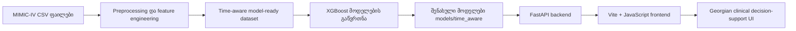

# ტექნიკური დოკუმენტაცია

პროექტი: გულ-სისხლძარღვთა დაავადებების ადრეული დიაგნოსტიკის დამხმარე სისტემა მანქანური სწავლების გამოყენებით

ავტორი: ნინო ჯინჭარაძე

GitHub repository:

```text
https://github.com/Ninucaa/bachelor-thesis-cardiovascular-ml
```

## 1. პროექტის მიზანი

პროექტის მიზანია შეიქმნას decision-support ტიპის ვებ სისტემა, რომელიც პაციენტის კლინიკური მონაცემების საფუძველზე აფასებს გულ-სისხლძარღვთა დაავადებების სავარაუდო დიაგნოსტიკურ მიმართულებას. სისტემა არ ცვლის ექიმის საბოლოო გადაწყვეტილებას. მისი დანიშნულებაა ექიმს ან მომხმარებელს აჩვენოს, რომელ ICD-კოდირებულ გულ-სისხლძარღვთა დიაგნოზის ჯგუფთან ხედავს მოდელი ყველაზე ძლიერ სიგნალს და რომელი ფაქტორები განსაზღვრავს ამ შედეგს.

სისტემა აფასებს შემდეგ დიაგნოსტიკურ ჯგუფებს:

- მიოკარდიუმის ინფარქტი
- გულის უკმარისობა
- სუბარაქნოიდული სისხლჩაქცევა
- ინტრაცერებრული სისხლჩაქცევა
- იშემიური ინსულტი / ცერებრული ინფარქტი
- სხვა ცერებროვასკულური დაავადება
- AV ბლოკადა / გამტარობის დარღვევა
- გულის გაჩერება
- პაროქსიზმული ტაქიკარდია
- წინაგულთა ფიბრილაცია / flutter
- სხვა გულის არითმია
- პირველადი ჰიპერტენზია
- ჰიპერტენზიული გულის დაავადება
- ჰიპერტენზიული თირკმლის დაავადება
- ჰიპერტენზიული გულის და თირკმლის დაავადება
- ჰიპერტენზიული კრიზი
- სტენოკარდია
- მწვავე იშემიური გულის დაავადება
- ქრონიკული იშემიური გულის დაავადება

## 2. სისტემის არქიტექტურა

მაღალი დონის არქიტექტურა:



ძირითადი კომპონენტები:

- `src/build_time_aware_dataset.py` - MIMIC-IV ფაილებიდან time-aware dataset-ის აგება.
- `src/train_time_aware_model.py` - ძირითადი და subtype XGBoost მოდელების გაწვრთნა.
- `src/build_diagnosis_thresholds.py` - diagnosis threshold-ების შერჩევა validation split-ზე.
- `src/api/app.py` - FastAPI endpoint-ები.
- `src/api/model_service.py` - მოდელის ჩატვირთვა, feature validation, prediction და ინტერპრეტაცია.
- `frontend/src/main.js` - ქართულენოვანი UI და API-სთან კომუნიკაცია.
- `frontend/src/styles.css` - frontend-ის ვიზუალური სტილი.
- `scripts/run_backend.sh` - backend-ის სტაბილური local run script.
- `scripts/run_frontend.sh` - frontend-ის local run script.
- `scripts/test_backend.sh` - backend API smoke tests.
- `Dockerfile`, `docker-compose.yml` - backend-ის containerized გაშვების კონფიგურაცია.

## 3. მონაცემები

მონაცემთა წყაროა MIMIC-IV/PhysioNet-ის დეიდენტიფიცირებული კლინიკური მონაცემები. raw CSV ფაილები GitHub-ზე არ არის ატვირთული, რადგან ისინი დიდი ზომისაა და ექვემდებარება მონაცემთა გამოყენების შეზღუდვებს.

გამოყენებული მონაცემთა ჯგუფები:

- admissions და patients - admission და დემოგრაფიული ინფორმაცია.
- diagnoses_icd - ICD კოდებზე დაფუძნებული სამიზნე ცვლადები და ისტორიული დაავადებები.
- labevents - ლაბორატორიული მაჩვენებლები.
- chartevents - vital signs/ICU ტიპის გაზომვები.
- edstays და triage - გადაუდებელი განყოფილების triage მონაცემები.
- omr - BMI, წონა, სიმაღლე და outpatient blood pressure.

Final time-aware dataset-ის summary ინახება:

```text
reports/time_aware_dataset_report.md
reports/time_aware_feature_summary.json
```

## 4. Preprocessing და feature engineering

Preprocessing-ის მთავარი პრინციპია time-aware აგება: მოდელმა არ უნდა გამოიყენოს ისეთი ინფორმაცია, რომელიც პაციენტის ადრეული შეფასების მომენტში ჯერ ცნობილი არ იქნებოდა.

შესრულებული ნაბიჯები:

- მონაცემების გაერთიანება admission დონეზე.
- ლაბორატორიული და vital signs მონაცემების აგრეგაცია პირველი 24 საათის ფარგლებში.
- ICD კოდების საფუძველზე subtype target-ების შექმნა.
- დიაბეტის, თირკმლის ქრონიკული დაავადების, სიმსუქნის და თამბაქოს/ნიკოტინის ისტორიის გამოთვლა prior admission-ებიდან.
- triage chief complaint-იდან სიმპტომების binary feature-ებად ამოღება.
- არარეალისტური კლინიკური მნიშვნელობების missing-ად მონიშვნა.
- missing indicator სვეტების დამატება.
- numeric missing values-ის შევსება training split-ის median-ით.
- train/validation/test დაყოფა subject_id-ის დონეზე, patient leakage-ის შესამცირებლად.

## 5. მოდელის აგება

გამოყენებულია XGBoost classifier. არჩევანი განპირობებულია tabular clinical data-ზე მისი პრაქტიკული ეფექტიანობით და არახაზოვანი/კომბინაციური კავშირების სწავლით.

გაწვრთნილია:

- ერთი ძირითადი მოდელი საერთო გულ-სისხლძარღვთა დიაგნოსტიკური სიგნალისთვის.
- 19 subtype მოდელი კონკრეტული ICD-კოდირებული დიაგნოზის ჯგუფებისთვის.

მოდელები ინახება:

```text
models/time_aware/
```

მეტრიკები ინახება:

```text
reports/time_aware_model_metrics.md
reports/time_aware_model_metrics.json
reports/diagnosis_thresholds.md
```

## 6. შედეგები

ძირითადი მოდელის test შედეგები:

| მოდელი | AUC-ROC | Avg Precision | F1 | Recall | Precision |
|---|---:|---:|---:|---:|---:|
| საერთო გულ-სისხლძარღვთა დიაგნოსტიკური სიგნალი | 0.8871 | 0.9165 | 0.8318 | 0.8134 | 0.8511 |

Subtype მოდელების test AUC:

| დიაგნოზის ჯგუფი | AUC-ROC |
|---|---:|
| მიოკარდიუმის ინფარქტი | 0.9337 |
| გულის უკმარისობა | 0.8801 |
| სუბარაქნოიდული სისხლჩაქცევა | 0.9275 |
| ინტრაცერებრული სისხლჩაქცევა | 0.9107 |
| იშემიური ინსულტი / ცერებრული ინფარქტი | 0.8600 |
| სხვა ცერებროვასკულური დაავადება | 0.7988 |
| AV ბლოკადა / გამტარობის დარღვევა | 0.7709 |
| გულის გაჩერება | 0.8950 |
| პაროქსიზმული ტაქიკარდია | 0.7866 |
| წინაგულთა ფიბრილაცია / flutter | 0.8410 |
| სხვა გულის არითმია | 0.7247 |
| პირველადი ჰიპერტენზია | 0.7929 |
| ჰიპერტენზიული გულის დაავადება | 0.8507 |
| ჰიპერტენზიული თირკმლის დაავადება | 0.9363 |
| ჰიპერტენზიული გულის და თირკმლის დაავადება | 0.9430 |
| ჰიპერტენზიული კრიზი | 0.8946 |
| სტენოკარდია | 0.8042 |
| მწვავე იშემიური გულის დაავადება | 0.8769 |
| ქრონიკული იშემიური გულის დაავადება | 0.8457 |

სამედიცინო კონტექსტში მნიშვნელოვანი განმარტება: subtype მოდელებზე precision ზოგიერთ შემთხვევაში დაბალია კლასების დისბალანსის გამო. ამიტომ სისტემა უნდა განიხილებოდეს როგორც screening/decision-support ინსტრუმენტი და არა საბოლოო დიაგნოზის ავტომატური დამსმელი.

## 7. Explainability / ინტერპრეტაცია

პროექტში გამოყენებულია SHAP-ის იდეა მოდელის ახსნადობისთვის. Backend ითვლის კონკრეტული პაციენტის პროგნოზზე გავლენიან ფაქტორებს და frontend-ში აჩვენებს მოკლე ქართულ განმარტებას.

ინტერფეისში შედეგი წარმოდგენილია შემდეგი სახით:

- სავარაუდო დიაგნოზის ჯგუფი.
- ალბათობა და threshold.
- მოდელის დიაგნოსტიკური სიგნალის დონე.
- მოკლე განმსაზღვრელი ფაქტორები.
- კლინიკური გადამოწმების რეკომენდებული მიმართულებები.
- subtype risk-ების სრული სია.

## 8. Backend API დოკუმენტაცია

Backend მუშაობს FastAPI-ზე.

გაშვების შემდეგ Swagger documentation ხელმისაწვდომია:

```text
http://127.0.0.1:8765/docs
```

Endpoint-ები:

| Method | Endpoint | დანიშნულება |
|---|---|---|
| GET | `/health` | API-ის და მოდელის ჩატვირთვის სტატუსი |
| GET | `/features` | მოდელის feature schema |
| GET | `/sample-patient` | test split-იდან demo პაციენტის მონაცემები |
| POST | `/predict` | პაციენტის feature payload-ზე პროგნოზის დაბრუნება |

`GET /health` response:

```json
{
  "status": "ok",
  "model_loaded": true,
  "feature_count": 140
}
```

`POST /predict` request-ის ზოგადი ფორმა:

```json
{
  "features": {
    "age": 67,
    "gender_male": 1
  },
  "top_n": 6
}
```

რეალურ მოთხოვნაში `features` უნდა შეიცავდეს ყველა feature-ს, რომელსაც `/features` აბრუნებს.

## 9. ინსტალაცია და გაშვება

Python dependency-ები:

```bash
cd /Users/ninucaaa/Desktop/new_project/bachelor-cardio-ai-project
python3 -m venv .venv
.venv/bin/python -m pip install -r requirements.txt
```

Backend-ის გაშვება:

```bash
cd /Users/ninucaaa/Desktop/new_project/bachelor-cardio-ai-project
scripts/run_backend.sh
```

Frontend dependency-ები და გაშვება:

```bash
cd /Users/ninucaaa/Desktop/new_project/bachelor-cardio-ai-project/frontend
npm install
../scripts/run_frontend.sh
```

მისამართები:

```text
Frontend: http://127.0.0.1:5173
Backend docs: http://127.0.0.1:8765/docs
```

სერვისების შემოწმება:

```bash
cd /Users/ninucaaa/Desktop/new_project/bachelor-cardio-ai-project
scripts/check_services.sh
```

Backend API smoke tests:

```bash
cd /Users/ninucaaa/Desktop/new_project/bachelor-cardio-ai-project
scripts/test_backend.sh
```

Docker-ით backend-ის გაშვება:

```bash
cd /Users/ninucaaa/Desktop/new_project/bachelor-cardio-ai-project
docker compose up --build
```

შენიშვნა: Docker Desktop/daemon უნდა იყოს გაშვებული. Docker image იყენებს GitHub-ზე შენახულ saved model ფაილებს და raw MIMIC-IV CSV ფაილებს არ აკოპირებს.

## 10. მომხმარებლის სახელმძღვანელო

სრული მომხმარებლის სახელმძღვანელო ცალკე ფაილად ინახება:

```text
docs/user_manual_ge.md
```

ძირითადი გამოყენების flow:

1. მომხმარებელი ხსნის frontend-ს.
2. იტვირთება demo პაციენტის მონაცემები.
3. მომხმარებელი საჭიროებისამებრ ცვლის პაციენტის მონაცემებს: ასაკი, სქესი, წონა, სიმაღლე, წნევა, ლაბორატორიული პასუხები, triage მონაცემები, ECG-ის მოკლე შეფასება და დამატებითი სიმპტომები.
4. BMI ავტომატურად ითვლება წონისა და სიმაღლის მიხედვით.
5. ლაბორატორიული და BMI ნორმები იხსნება ცალკე ფანჯარაში.
6. მომხმარებელი აჭერს პროგნოზის გაშვებას.
7. სისტემა აჩვენებს სავარაუდო დიაგნოზის ჯგუფს, რისკის განმსაზღვრელ ფაქტორებს და subtype სიის შედარებას.
8. ტექნიკური მოდელის შეფასება იხსნება ცალკე ფანჯარაში, რათა კლინიკური შედეგი ზედმეტად არ გადაიტვირთოს.
9. მომხმარებელს შეუძლია ნახოს ქართულად გენერირებული პაციენტის ანგარიში.

ECG ველი ამ ვერსიაში გამოიყენება როგორც არასავალდებულო კლინიკური კონტექსტი. ის ჩანს ინტერპრეტაციასა და პაციენტის ანგარიშში, მაგრამ არ ცვლის მოდელის probability-ს, რადგან საბოლოო time-aware მოდელი ECG-derived feature-ებზე ხელახლა არ არის გაწვრთნილი.

ტემპერატურის ველი მომხმარებლისთვის ნაჩვენებია ცელსიუსში (`°C`). backend-ში მოდელის feature schema-სთან თავსებადობისთვის იგივე მნიშვნელობა ავტომატურად გარდაიქმნება Fahrenheit-ში, რადგან გაწვრთნილ model-ready dataset-ში triage ტემპერატურის feature ინახება სახელით `ed_triage_temperature_f_mean`.

Use case 1 - demo პაციენტის შეფასება:

- მომხმარებელი ხსნის აპლიკაციას.
- ტოვებს sample patient-ის მონაცემებს.
- აჭერს პროგნოზის ღილაკს.
- სისტემა აჩვენებს სავარაუდო დიაგნოზის ჯგუფს და განმსაზღვრელ ფაქტორებს.

Use case 2 - ახალი პაციენტის მონაცემების შეცვლა:

- მომხმარებელი ცვლის წონას, სიმაღლეს, წნევას, ლაბორატორიულ პასუხებს და სიმპტომებს.
- სისტემა ავტომატურად ითვლის BMI-ს და აახლებს derived features-ს.
- პროგნოზის გაშვებისას backend იღებს სრულ feature payload-ს და აბრუნებს განახლებულ შედეგს.

## 11. უსაფრთხოება და ეთიკური მხარე

პროექტი არ იყენებს რეალური იდენტიფიცირებადი პაციენტების მონაცემებს frontend demo-ში. MIMIC-IV არის დეიდენტიფიცირებული კლინიკური მონაცემთა ბაზა.

სისტემა არ უნდა იქნას გამოყენებული როგორც დამოუკიდებელი კლინიკური გადაწყვეტილების მიმღები სისტემა. შედეგი უნდა დადასტურდეს ექიმის მიერ.

## 12. პროექტის შეზღუდვები

- სისტემა არის prototype/MVP და არა სამედიცინო მოწყობილობა.
- გამოყენებულია retrospective hospital-based მონაცემები, ამიტომ სხვა პოპულაციებზე შედეგი შეიძლება განსხვავდებოდეს.
- ECG raw signal/image recognition არ არის დამატებული.
- ECG პასუხი frontend-ში დამატებულია როგორც optional clinical context, არა როგორც probability-ის პირდაპირი model feature.
- Radiology/chest X-ray არ არის გამოყენებული.
- PostgreSQL და hospital system integration არ არის მიმდინარე ვერსიაში.
- Docker containerization დამატებულია backend API-სთვის, მაგრამ local Docker build საჭიროებს გაშვებულ Docker daemon-ს.
- UCI Heart Disease Dataset-ზე external validation არ არის შესრულებული.
- SMOTE საბოლოო time-aware pipeline-ში არ არის გამოყენებული; class imbalance ნაწილობრივ მოდელის პარამეტრებით და threshold selection-ით მუშავდება.

## 13. PDF გეგმასთან განსხვავებები

შუალედურ PDF-ში პროექტის საწყის გეგმაში ნახსენები იყო React, Tailwind CSS, Docker, PostgreSQL, SMOTE და UCI external validation. საბოლოო MVP-ში პრიორიტეტი მიენიჭა მუშა clinical decision-support prototype-ს, time-aware preprocessing-ს, subtype დიაგნოზის ჯგუფებს, FastAPI backend-ს, ქართულ frontend demo-ს, backend smoke tests-ს და Docker configuration-ს.

საბოლოო პროექტის რეალური frontend აგებულია Vite + vanilla JavaScript + CSS-ით. ეს არ ამცირებს ფუნქციურობას, რადგან აპლიკაცია მუშაობს როგორც full interactive web interface, მაგრამ ტექნიკურ დოკუმენტაციაში არ უნდა ჩაიწეროს React/Tailwind როგორც შესრულებული კომპონენტი.

## 14. ჩასაბარებელი მასალები

საბოლოო ჩაბარებისთვის პროექტში მომზადებულია შემდეგი კომპონენტები:

- სამუშაო prototype: FastAPI backend და Vite JavaScript frontend.
- Source code GitHub-ზე: `https://github.com/Ninucaa/bachelor-thesis-cardiovascular-ml`
- ტექნიკური დოკუმენტაცია: `docs/technical_report_ge.md`
- მომხმარებლის სახელმძღვანელო: `docs/user_manual_ge.md`
- demo სცენარი: `docs/demo_script.md`
- README ფაილი repository-ის root საქაღალდეში.
- backend smoke tests: `tests/test_api_smoke.py`
- Docker configuration backend-ისთვის: `Dockerfile`, `docker-compose.yml`

საბოლოო Word/PDF report-ში რეკომენდებულია დამატდეს ეკრანის სქრინშოტები შემდეგი ნაწილებისთვის: მთავარი frontend, პროგნოზის შედეგი, დაავადების ჯგუფების შედარება, ლაბორატორიული ნორმების ფანჯარა, მოდელის ტექნიკური შეფასება და Swagger `/docs`.

## 15. მომავალი განვითარება

შემდეგი გაუმჯობესებები:

- ECG processed results-ის optional input-ის გაფართოება.
- external validation სხვა dataset-ზე.
- model cards და data cards.
- deployment guide.
- პაციენტის ისტორიის შენახვა database-ში.
- calibration analysis და threshold-ების დამატებითი კლინიკური გადამოწმება.
